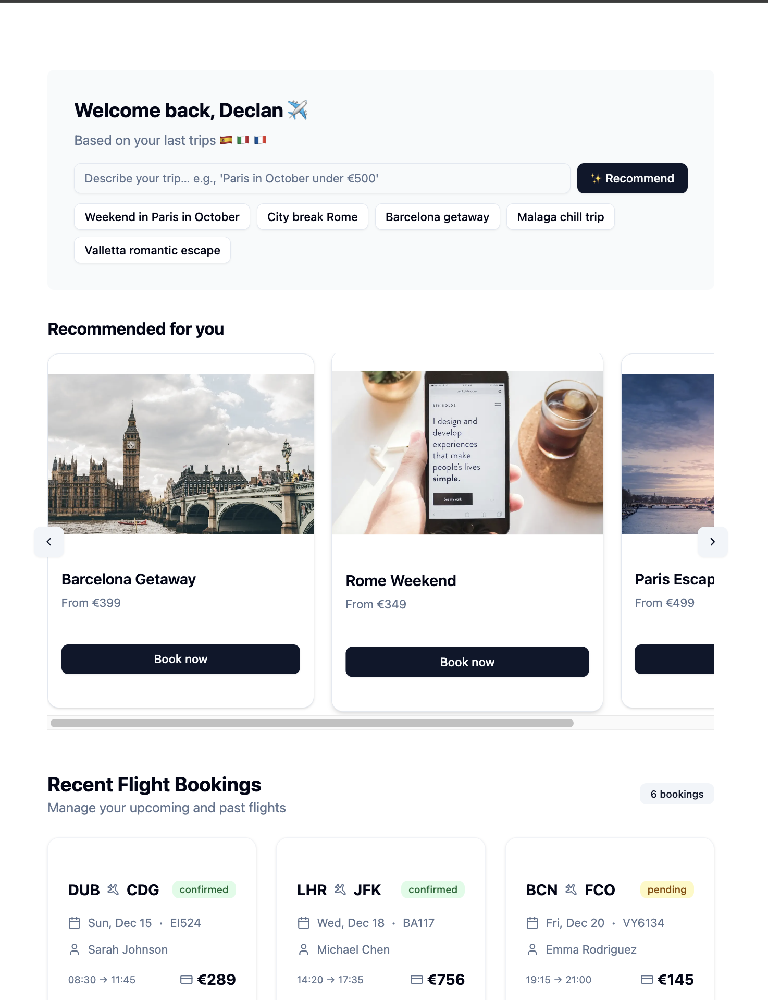

# ✈️ NextDestination

> An AI-powered travel assistant helping users discover and book their next adventure — built with Spring Boot, PostgreSQL, Next.js, and Vercel.

---

## 💻 Demo Screenshot

---

## 🌍 Overview

**NextDestAInation** is a modern, full-stack travel assistant demo designed to showcase:
- 🔍 **AI-based destination recommendations**
- 🧾 **Booking management system**
- 📈 **Business dashboard (v2 planned)**
- 🚀 **CI/CD and cloud readiness**

This project was built as a real-world showcase of clean architecture, modern tooling, and AI integration — aimed at demonstrating leadership and technical delivery in a team lead context.

---

## 🧱 Tech Stack

| Layer            | Tech / Tool                                     |
|------------------|-------------------------------------------------|
| Frontend         | Next.js 14, Vercel, TailwindCSS, ShadCN UI      |
| Backend          | Spring Boot 3.x, Java 17, JPA                   |
| Database         | PostgreSQL (hosted on Neon)                     |
| AI Integration   | Simple prompt-to-destination flow (OpenAI-ready)|
| CI/CD            | GitHub Actions → Vercel & Render deploy         |
| DevOps           | Sentry (logging), GitHub Projects, VS Code      |

---

## 🧪 Features

- ✅ AI-powered destination recommendations
- ✅ Save and view bookings
- ✅ Fully styled UI using V0 and ShadCN
- ✅ PostgreSQL-based backend with JPA
- ✅ CI/CD setup for both frontend and backend
- 🛠️ Admin dashboards and analytics (coming v2)